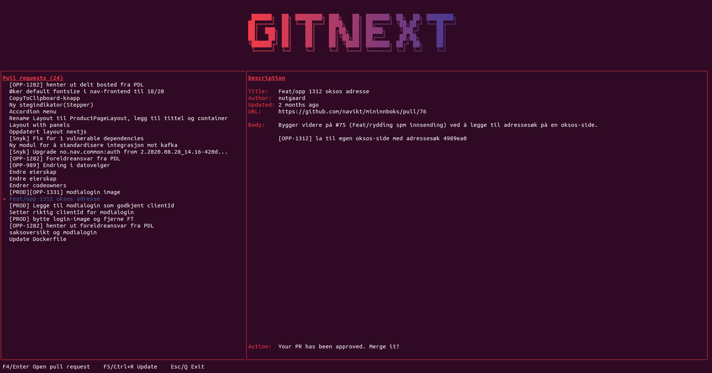

# GitNext

Small cli to help prioritize your github tasks



The motivation behind this package is to aid in discoverability and prioritization 
when using github as a primary source-control system. 
Github has its own [pull-request view](https://github.com/pulls) which can be extremely useful in many cases.
However it is not always a good match when using code-owners and required reviews from teams.

## Prerequisites
This package uses [github's own cli](https://cli.github.com/), and requires you to be logged in.

Login can be done be issuing the command `gh auth login`, and verified by `gh auth status`.

## Install

To install this package;
`npm i @nutgaard/gitnext -g`

## Run
After installation, run it;
`gitnext`

**NB** Some terminals require a restart in order to pick up on globally installed script. 

## Configuration
GitNext allows the user to configure what repositories and teams they would like to follow.
This configuration is located at `$HOME/.gitnext.yaml` and is automatically created the first time you start GitNext.

An example configuration;
```yaml
sources:
  - username: __self__                     # __self__ is based on your current user.
    ignore:
      - repo: another-username/legacy      # A repository, which you have access to. But dont want to actively follow
      - username: dependabot               # Ignore pull-requests from this user
  - organization: your-awesome-org
    #Due to how large organizations can be, we have to explicit about which teams and repos we are interested in
    include:
      - team: the-best-team                # A team you got access to
      - repo: repository-outside-team      # A repository outside of your primary team
    ignore:
      # In case a team has a repo you're not interested in
      - repo: your-awesome-org/old-legacy  # Ignore this old legacy repo in your org
      - username: annoying-coworker        # Ignore pull-request from this user (within this org)
```
